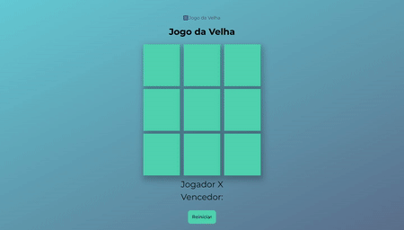

 

  

<h3 align="center">Jogo da Velha</h3>
  

    Projeto do Jogo da Velha para jogar online
     
    <a href="https://carmeleticia.github.io/Jogo-da-Velha/" target="_blank"  >Acessar a Demo</a>

<!-- ABOUT THE PROJECT -->

## Sobre o Projeto

O Jogo da Velha é um clássico que desafia os seus conhecmimentos, uma maneira divertida de aprender e se divertir com seus amigos.
 
O jogo foi criado, como parte de conclusão do Bootcamp Órbi Web Games Developer da plataforma de programação [Dio](https://web.dio.me/home).

### Feito com:

- [HTML](https://developer.mozilla.org/pt-BR/docs/Web/HTML)
- [CSS](https://developer.mozilla.org/pt-BR/docs/Web/CSS)
- [Javascript](https://www.javascript.com/)
